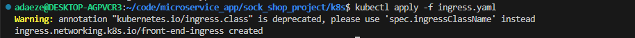
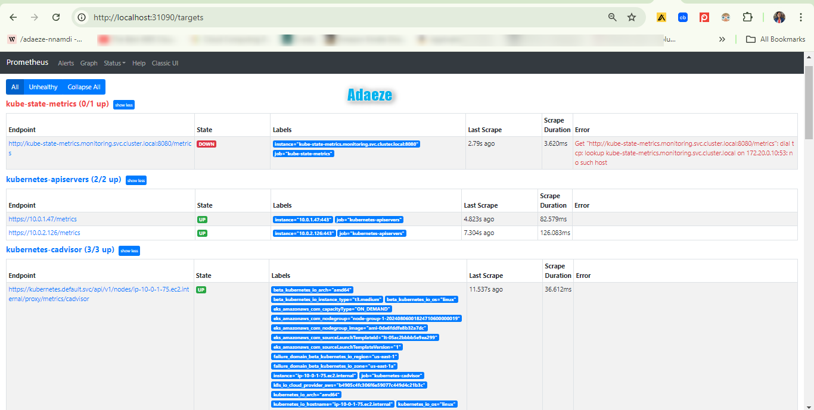
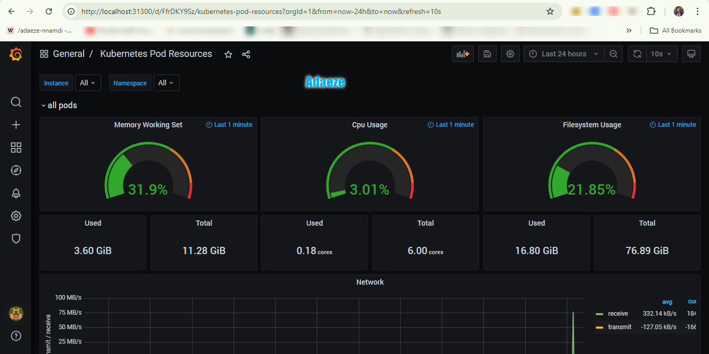
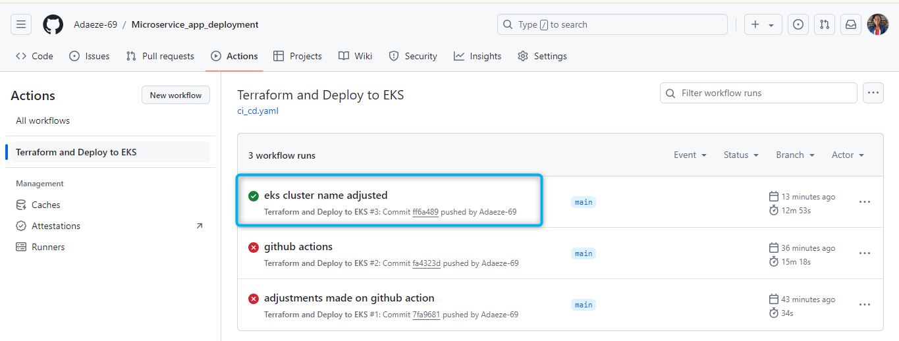
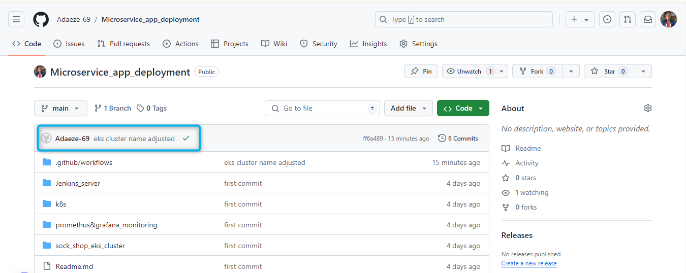
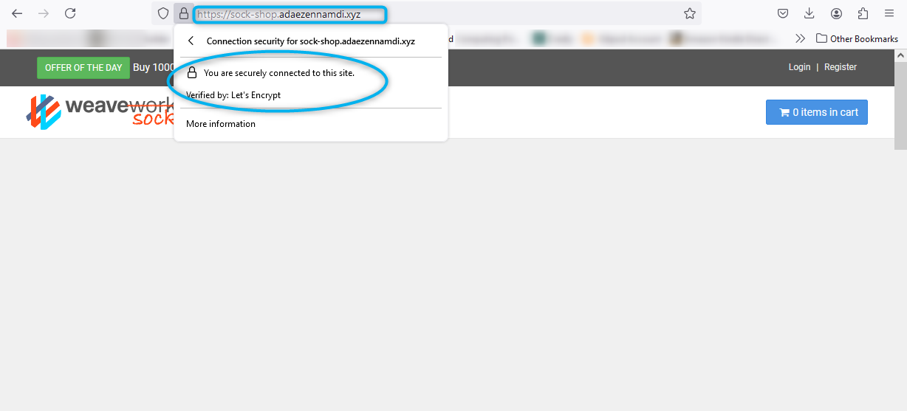

# Deployment of a Microservice App (Socks Shop) on Kubernetes using Infrastructure as a Code(terraform) and CI/CD Pipeline(Jenkins)

## Microservice Architecture

A software application built using microservice architecture is made up of discrete, independent services that interact with one another using clearly defined APIs. Every service can be independently built, deployed, and scaled, and each one is concentrated on a single business function. In contrast, all the elements of classic monolithic building are woven together to form a single, harmonious one.

The Microservices Demo project is an educational and illustrative example of a cloud-native microservices application. 
The project demonstrates a complete e-commerce application built using microservices. It showcases how an application can be split into smaller, independent services, each responsible for a specific functionality like product catalog, user management, order processing, and payment.Manages user data, authentication, and authorization.Handles product listings, descriptions, and inventory management.

### Deployment Process


Here is a detailed breakdown, focusing on the deployment of a microservice application using Terraform, Kubernetes, and GitHub Actions.

---

# Microservice App Deployment

This repository contains code for deploying a microservices-based application (Socks Shop) on Kubernetes using Infrastructure as Code (IaC) with Terraform and a CI/CD pipeline with GitHub Actions.

## Table of Contents

1. [Project Objective](#project-objective)
2. [The Project Tree Structure](#the-project-tree-structure)
3. [Prerequisites](#prerequisites)
4. [Architecture](#architecture)
5. [Setup](#setup)
    1. [Clone the Repository](#clone-the-repository)
    2. [Configure AWS Credentials](#configure-aws-credentials)
6. [Infrastructure Deployment](#infrastructure-deployment)
    1. [VPC and EKS Cluster](#vpc-and-eks-cluster)
    2. [Helm and Ingress](#helm-and-ingress)
7. [ Monitoring with Grafana and Prometheus]( #monitoring-with-grafana-and-prometheus)
8. [Application Deployment](#application-deployment)
9. [Destroying the Infrastructure](#destroying-the-infrastructure)
10. [Running the Pipeline](#running-the-pipeline)
11. [Troubleshooting](#troubleshooting)
12. [Conclusion](#conclusion)


## The Project Tree Structure
```
Microservice_app_deployment/sock_shop_project
├── .github/
│   └── workflows/
│       └── ci_cd.yaml
├── k8s/
│   ├── cluster.yaml
│   ├── ingress.yaml
│   ├── sock_shop.yaml
│   └── get_cluster_ip.sh
├── prometheus&grafana_monitoring/
│   ├── 00-monitoring-ns.yaml
│   ├── prometheus.yaml
│   ├── grafana.yaml
│   └── ...
├── sock_shop_eks_cluster/
│   ├── main.tf
│   ├── variables.tf
│   ├── outputs.tf
│   └── ...
└── README.md

```
## Project Objective

The goal of this project is to deploy the Socks Shop application, a microservices-based e-commerce application, on a Kubernetes cluster using Terraform for infrastructure management and GitHub Actions for CI/CD.

## Prerequisites

- AWS Account with sufficient permissions and credits
- Domain name (e.g., from Namecheap)
- Terraform installed
- kubectl installed
- Helm installed
- GitHub account and repository

## Architecture

The application is deployed using the following architecture:
- **AWS VPC**: A Virtual Private Cloud to host the Kubernetes cluster.
- **AWS EKS**: Amazon Elastic Kubernetes Service for container orchestration.
- **Helm**: For managing Kubernetes applications.
- **Nginx Ingress Controller**: For managing external access to the services.
- **Cert-Manager**: For handling SSL/TLS certificates.

## Setup

### Clone the Repository

```
git clone https://github.com/Adaeze-69/Microservice_app_deployment.git
cd Microservice_app_deployment

```

### Configure AWS Credentials

Set up your AWS credentials in GitHub Secrets:
- `AWS_ACCESS_KEY_ID`
- `AWS_SECRET_ACCESS_KEY`

## Infrastructure Deployment

### VPC and EKS Cluster

The VPC and EKS cluster are managed using Terraform.

1. **Initialize Terraform**

    ```
    cd sock_shop_eks_cluster
    terraform init
    ```

2. **Plan and Apply Terraform Configuration**

    ```
    terraform plan
    terraform apply --auto-approve
    ```

### Helm and Ingress

Deploy the Nginx Ingress controller and Cert-Manager using Helm.

1. **Create Namespace**

    ```
    kubectl create ns ingress-nginx
    ```

2. **Add and Install Helm Charts**

    ```
    helm repo add ingress-nginx https://kubernetes.github.io/ingress-nginx
    helm install nginx ingress-nginx/ingress-nginx -n ingress-nginx
    ```

3. **Install Cert-Manager**

    ```
    kubectl create namespace cert-manager
    kubectl apply -f https://github.com/cert-manager/cert-manager/releases/download/v1.14.4/cert-manager.yaml
    ```

## Application Deployment

Deploy the Socks Shop application using Kubernetes manifests.

1. **Apply Kubernetes Manifests**

    ```
    kubectl apply -f k8s/sock_shop.yaml
    kubectl apply -f k8s/ingress.yaml
    ```
    

2. **Verify Deployment**

    ```
    kubectl get pods -n sock-shop
    kubectl get svc -n sock-shop
    ```


    Here’s how you can expand on the Grafana and Prometheus section in your README, including the commands you used to set them up:

---

## Monitoring with Grafana and Prometheus

This project includes the setup of **Grafana** and **Prometheus** for monitoring the Kubernetes cluster and the microservices deployed within it.

#### Prometheus Setup
Prometheus is used to scrape and store metrics from your Kubernetes cluster and applications. The setup includes:

1. **Namespace Creation**:
   ```
   kubectl create -f 00-monitoring-ns.yaml
   ```
   This command creates the necessary namespace for monitoring components.

2. **Prometheus Deployment**:
   ```
   kubectl apply -f prometheus.yaml -n monitoring
   ```
   This command deploys Prometheus within the `monitoring` namespace.

   
#### Grafana Setup
Grafana is utilized to visualize the metrics collected by Prometheus, allowing you to monitor the health and performance of your services.

1. **Grafana Deployment**:
   ```
   kubectl apply -f grafana.yaml -n monitoring
   ```
   Deploys Grafana in the `monitoring` namespace.

2. **Port Forwarding**:
   ```
   kubectl port-forward service/grafana 31300:80 -n monitoring
   ```
   This command forwards port 31300 on your local machine to port 80 of the Grafana service, making the Grafana UI accessible via `http://localhost:31300`.

#### Accessing Grafana Dashboards

Once the Grafana service is up and running, you can access it using your web browser by navigating to `http://localhost:31300`. The default login credentials are typically:

- **Username**: `admin`
- **Password**: `admin` (or as configured in your deployment)



You can then import or create dashboards to visualize the metrics scraped by Prometheus.

---

By including this section, your README will provide a comprehensive guide on how Grafana and Prometheus were set up, and how they are utilized in your project for monitoring.

## Destroying the Infrastructure

To destroy the infrastructure, run the following commands:

```
cd sock_shop_eks_cluster
terraform destroy --auto-approve
```

## Running the Pipeline

The CI/CD pipeline is defined in the `.github/workflows` directory.The `.github/workflows` directory is where I defined my GitHub Actions workflows. These workflows automate various tasks like CI/CD pipelines, deployments, testing, and more.

For this project, the `ci_cd.yaml` file within this directory is the core of the automation. It includes steps to:

1. **Set Up the Environment:** Install necessary tools like Terraform, Helm, and kubectl.
2. **Deploy Infrastructure:** Automatically create resources in AWS using Terraform.
3. **Deploy Applications:** Deploy the microservices, Ingress, and monitoring stack to EKS.
4. **Testing and Validation:** Run tests to ensure that deployments are successful.
5. **Cleanup:** (Necessary) Destroy resources after the workflow is completed, preventing unnecessary costs.

By defining everything in the `ci_cd.yaml` file, the entire deployment process—from infrastructure creation to application deployment—is automated. This ensures consistency, reduces manual effort, and allows for quick iterations.

*After 2 failed deployments,it finally went through! yay!*



1. **First Run**

    This will create the infrastructure and deploy the application.

    It should like this on your repo after a successful deployment.

    

2. **Second Run**

    The second run will destroy the infrastructure after confirming everything is deployed correctly.


>This is an image of the sock shop  deployment and secured with *Let's Encrypt* which is a certificate authority (CA) that provides free SSL/TLS certificates to enable HTTPS on websites.



## Troubleshooting

If you encounter issues, check the logs from the GitHub Actions runs and the Kubernetes pods. Common issues may include incorrect AWS credentials, misconfigured Kubernetes manifests, or missing Helm charts. This way,you can know what to easily debug or configure.

## Conclusion

This project offers a complete solution for delivering a microservice-based application on AWS EKS via a fully automated CI/CD pipeline that includes GitHub Actions. The configuration includes Terraform for infrastructure provisioning, Helm and kubectl for application deployment, and Prometheus and Grafana for monitoring. Using these technologies makes the deployment process more efficient and repeatable, assuring consistency and reliability in your environments. This repository provides a strong foundation for developing and managing scalable, cloud-native apps on AWS.